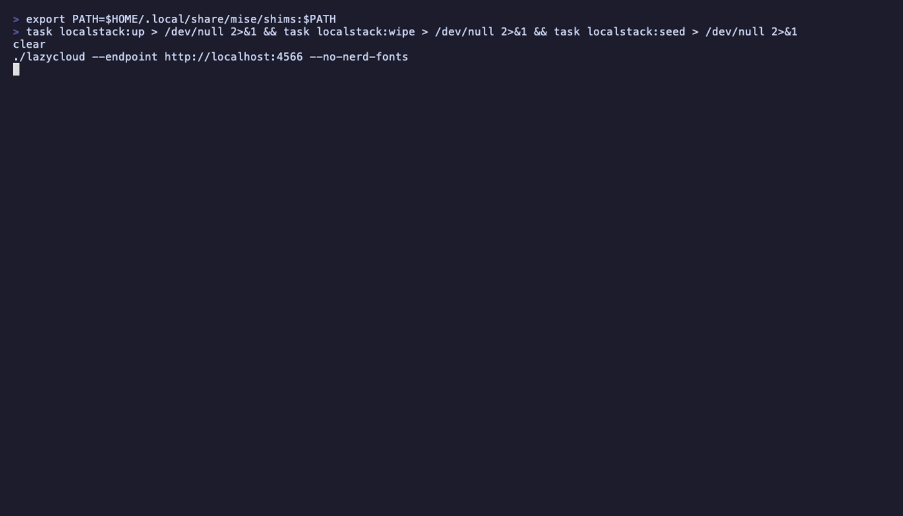

# LazyCloud

[](https://github.com/juthrbog/lazycloud/actions/workflows/ci.yml)
[](https://go.dev)
[](LICENSE)

A terminal user interface (TUI) for browsing, managing, and interacting with AWS services and resources — without leaving your terminal. Built with Go and the [Charm](https://charm.sh) ecosystem, [inspired by](#inspired-by) tools like lazygit, k9s, and claws.

<!-- Record with: vhs demo/s3.tape -->


## Features

- Browse and manage AWS resources from your terminal
- Stack-based navigation with drill-down into resource details
- Filterable, sortable tables with vim-style keybindings
- Syntax-highlighted content viewer with visual line selection and yank to clipboard
- In-app event log for troubleshooting without leaving the TUI
- Multiple AWS profile and region support with fuzzy-search pickers
- 4 color themes (Catppuccin, Dracula, Nord, Tokyo Night) — switchable at runtime
- Nerd Font icons with Unicode fallbacks
- Open resources in `$EDITOR` directly from the TUI
- TOML config file with XDG base directory support
- LocalStack integration for local development

## Getting Started

```bash
# Build
go build -o lazycloud .

# Run against your default AWS profile
./lazycloud

# Specify a profile and region
./lazycloud --profile staging --region us-west-2

# Run against LocalStack
./lazycloud --endpoint http://localhost:4566
```

### With Taskfile

```bash
task deps              # download Go dependencies
task build             # build the binary
task run               # run against real AWS
task localstack:seed   # populate LocalStack with test data
task dev               # run against LocalStack
```

### CLI Flags

| Flag | Description |
|------|-------------|
| `--profile` | AWS profile (falls back to `AWS_PROFILE`) |
| `--region` | AWS region (falls back to `AWS_REGION`) |
| `--endpoint` | Endpoint override for LocalStack (falls back to `AWS_ENDPOINT_URL`) |
| `--theme` | Color theme: `catppuccin`, `dracula`, `nord`, `tokyonight` |
| `--no-nerd-fonts` | Use plain Unicode icons instead of Nerd Font glyphs |
| `--config` | Path to config file (default: `~/.config/lazycloud/config.toml`) |
| `--log` | Path to debug log file |
| `--init-config` | Write default config file and exit |

### Keybindings

**Global**

| Key | Action |
|-----|--------|
| `j`/`k` or arrows | Navigate up/down |
| `enter` | Drill into resource |
| `esc` | Go back |
| `/` | Filter/search |
| `r` | Refresh |
| `L` | Event log |
| `P` | Switch AWS profile |
| `R` | Switch AWS region |
| `T` | Switch theme |
| `:` | Command palette |
| `q` | Quit |

**Content Viewer**

| Key | Action |
|-----|--------|
| `j`/`k` | Move cursor |
| `g`/`G` | Jump to top/bottom |
| `ctrl+d`/`ctrl+u` | Half-page down/up |
| `V` | Visual line select |
| `y` | Yank to clipboard |
| `e` | Open in `$EDITOR` |
| `n` | Toggle line numbers |

## Configuration

LazyCloud uses a TOML config file. Generate the default config with:

```bash
./lazycloud --init-config
```

This creates `~/.config/lazycloud/config.toml` (or `$XDG_CONFIG_HOME/lazycloud/config.toml`):

```toml
[aws]
# profile = "default"
# region = "us-east-1"
# endpoint = ""

[display]
theme = "catppuccin"    # catppuccin, dracula, nord, tokyonight
nerd_fonts = true       # false for plain Unicode fallbacks

[log]
# file = "/tmp/lazycloud.log"
```

Settings are applied in order of precedence: **config file < env vars < CLI flags**.

Use `--config path` to specify a custom config file location.

## Supported Services

Only **AWS** is supported at this time. Other cloud providers may be added in the future.

### AWS

| Service | Status | Description |
|---------|--------|-------------|
| [S3](services/aws/s3.md) | Implemented | Browse buckets, navigate objects, preview/download files, copy/move, versioning, presigned URLs, create/delete buckets and objects |
| [EC2](services/aws/ec2.md) | Mock data | Browse instances (real API integration planned) |

## Tech Stack

- **Language:** Go
- **TUI Framework:** [Bubble Tea v2](https://github.com/charmbracelet/bubbletea) (`charm.land/bubbletea/v2`)
- **Styling:** [Lip Gloss v2](https://github.com/charmbracelet/lipgloss) (`charm.land/lipgloss/v2`)
- **Components:** [Bubbles v2](https://github.com/charmbracelet/bubbles) (`charm.land/bubbles/v2`)
- **Syntax Highlighting:** [Chroma](https://github.com/alecthomas/chroma)
- **Config:** [TOML](https://github.com/pelletier/go-toml)
- **AWS SDK:** [aws-sdk-go-v2](https://github.com/aws/aws-sdk-go-v2)
- **Task Runner:** [Taskfile](https://taskfile.dev)
- **Local AWS:** [LocalStack](https://github.com/localstack/localstack)

## Architecture & Patterns

LazyCloud follows the [Elm Architecture](https://guide.elm-lang.org/architecture/) (Model-View-Update) via Bubble Tea. Here are the key patterns used throughout the project:

### Layer Separation

```
internal/aws/       Pure AWS SDK calls. No UI imports. Returns plain Go structs.
internal/views/     Bubble Tea models. Calls AWS layer via tea.Cmd. Handles input and rendering.
internal/ui/        Reusable components (table, picker, toast, etc.). Not tied to any AWS service.
internal/app/       Root model — message router, layout compositor, view factory.
internal/nav/       Stack-based navigator with view caching.
internal/msg/       Shared message types for the event loop.
internal/config/    TOML config with layered precedence (file < env < flags).
internal/eventlog/  Thread-safe ring buffer for in-app event logging.
```

### Navigator (View Stack)

Views are pushed onto a stack when drilling into resources and popped on `esc`. Each view implements the `nav.View` interface (`ID()`, `Title()`, `KeyMap()`). Views are cached by ID so navigating back preserves scroll position and filter state.

### Message Flow

All side effects (AWS API calls, clipboard, file I/O) happen in `tea.Cmd` goroutines that return messages. Views never mutate state directly — they emit messages like `NavigateMsg`, `ToastMsg`, or `RequestConfirmMsg` that the app routes.

### Progressive Loading

Large S3 listings use command chaining: each page fetch returns a message, the handler appends data and returns a command for the next page. The table updates after each page so users see results within ~200ms.

### Overlay Compositing

Pickers, confirm dialogs, and toasts render on top of existing content using Lipgloss's Canvas/Layer system. The background view stays visible around the overlay.

### Contextual Keybindings

Each view declares its own `KeyMap()`. The status bar merges view-specific hints with global hints, so available actions update automatically as you navigate.

### Toast Notifications

Transient feedback (copy, download, delete) uses auto-dismissing toasts rendered in the bottom-right via Compositor overlay. Each toast gets a `time.Sleep` goroutine that sends a dismiss message after 4 seconds.

### Adding a New AWS Service

To add a new service (e.g., Lambda), create three files:

1. `internal/aws/lambda.go` — SDK calls returning plain structs
2. `internal/views/lambda_list.go` — view implementing `nav.View`
3. Register the view ID in `app.go`'s `resolveView()` and add it to the home view's service list

## Contributing

LazyCloud is in early development and not yet accepting contributions. This may change in the future — check back later.

## Inspired By

- [lazygit](https://github.com/jesseduffield/lazygit) — Git TUI
- [lazydocker](https://github.com/jesseduffield/lazydocker) — Docker TUI
- [k9s](https://github.com/derailed/k9s) — Kubernetes TUI
- [claws](https://github.com/clawscli/claws) — AWS TUI

## License

Licensed under the [Apache License 2.0](LICENSE).
