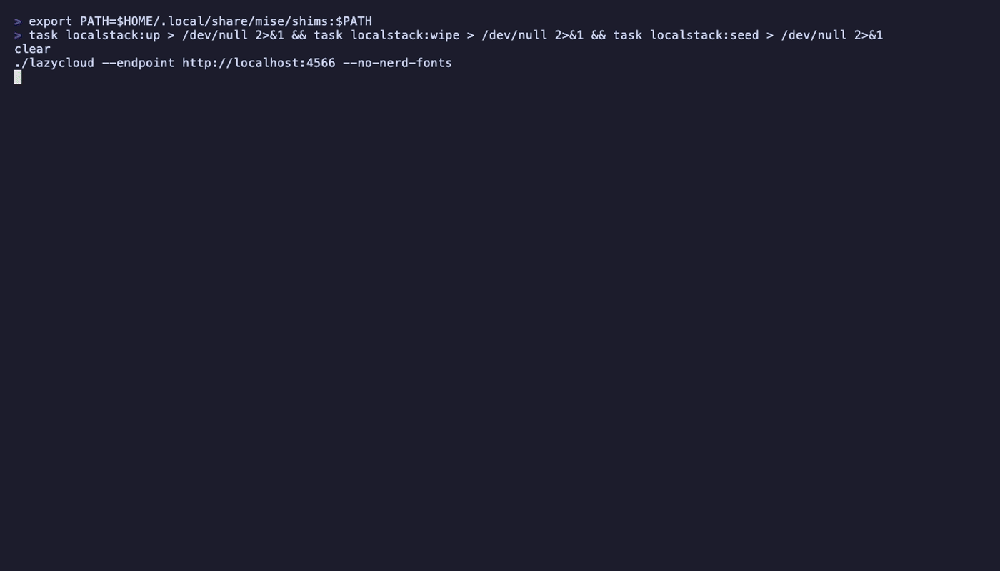

<h1 align="center">LazyCloud</h1>

<p align="center">
  A terminal UI for browsing and managing AWS resources
</p>

<p align="center">
  <a href="https://github.com/juthrbog/lazycloud/actions/workflows/ci.yml"></a>
  <a href="https://go.dev"></a>
  <a href="LICENSE"></a>
  <a href="https://goreportcard.com/report/github.com/juthrbog/lazycloud"></a>
  <a href="https://www.localstack.cloud/"></a>
</p>

<!-- Record with: vhs demo/s3.tape -->
<!-- <p align="center"></p> -->

Built with Go and the [Charm](https://charm.sh) ecosystem. Inspired by amazing TUIs like [lazygit](https://github.com/jesseduffield/lazygit) and [k9s](https://github.com/derailed/k9s).

## Features

- Browse and manage AWS resources without leaving your terminal
- **ReadOnly by default** — mutations blocked regardless of IAM permissions until you press `W`
- Drill-down navigation with a side detail panel on wide terminals (≥120 cols)
- Filterable, sortable tables with vim-style keybindings
- Multi-select with bulk actions (start/stop/delete across selections)
- Syntax-highlighted content viewer with visual selection and yank
- In-app event log, command bar, and fuzzy-search pickers
- Multiple AWS profiles and regions — switch at runtime
- 4 color themes (Catppuccin, Dracula, Nord, Tokyo Night)
- TOML config with XDG support, Nerd Font icons with Unicode fallbacks
- LocalStack integration for local development

## Supported Services

| Service | Description |
|---------|-------------|
| [S3](services/aws/s3.md) | Buckets, objects, versions, presigned URLs, copy/move, create/delete |
| [EC2](services/aws/ec2.md) | Instances, AMIs, start/stop/reboot/terminate, SSM connect, public AMI search |
| [SQS](services/aws/sqs.md) | Queues, message peek, send, purge, delete, DLQ redrive |

## Getting Started

### Install from releases

Download the latest binary from the [Releases](https://github.com/juthrbog/lazycloud/releases) page.

### Build from source

```bash
go build -o lazycloud .
./lazycloud
```

### Quick start

```bash
# Default AWS profile
./lazycloud

# Specify profile and region
./lazycloud --profile staging --region us-west-2

# Run against LocalStack
./lazycloud --endpoint http://localhost:4566
```

<details>
<summary>Using Taskfile</summary>

```bash
task deps              # download Go dependencies
task build             # build the binary
task run               # run against real AWS
task localstack:seed   # populate LocalStack with test data (see docs/DEVELOPMENT.md)
task dev               # run against LocalStack
```

</details>

### CLI Flags

| Flag | Description |
|------|-------------|
| `--profile` | AWS profile (falls back to `AWS_PROFILE`) |
| `--region` | AWS region (falls back to `AWS_REGION`) |
| `--endpoint` | Endpoint override for LocalStack (falls back to `AWS_ENDPOINT_URL`) |
| `--theme` | Color theme: `catppuccin`, `dracula`, `nord`, `tokyonight` |
| `--no-nerd-fonts` | Use plain Unicode icons instead of Nerd Font glyphs |
| `--config` | Path to config file (default: `~/.config/lazycloud/config.toml`) |
| `--log` | Path to debug log file |
| `--read-write` | Start in ReadWrite mode (default: ReadOnly) |
| `--init-config` | Write default config file and exit |
| `--version` | Print version and exit |

## Keybindings

| Key | Action |
|-----|--------|
| `j`/`k` or arrows | Navigate |
| `enter` | Drill into resource |
| `esc` | Go back / clear selection |
| `/` | Filter |
| `space` | Multi-select |
| `s`/`S` | Sort / reverse sort |
| `r` | Refresh |
| `W` | Toggle ReadOnly/ReadWrite |
| `tab` | Toggle panel focus |
| `:` | Command bar |
| `?` | Help overlay (full keybinding reference) |
| `q` | Quit / back |

Press `?` in-app for the complete list including view-specific and panel keybindings. See [docs/KEYBINDINGS.md](docs/KEYBINDINGS.md) for the keybinding system architecture.

## Configuration

Generate the default config:

```bash
./lazycloud --init-config
```

This creates `~/.config/lazycloud/config.toml` (or `$XDG_CONFIG_HOME/lazycloud/config.toml`):

```toml
[aws]
# profile = "default"
# region = "us-east-1"
# endpoint = ""

[display]
theme = "catppuccin"    # catppuccin, dracula, nord, tokyonight
nerd_fonts = true       # false for plain Unicode fallbacks

[log]
# file = "/tmp/lazycloud.log"
```

Precedence: **config file < env vars < CLI flags**.

## Tech Stack

[Bubble Tea v2](https://github.com/charmbracelet/bubbletea) | [Lip Gloss v2](https://github.com/charmbracelet/lipgloss) | [Bubbles v2](https://github.com/charmbracelet/bubbles) | [Huh v2](https://github.com/charmbracelet/huh) | [Chroma](https://github.com/alecthomas/chroma) | [aws-sdk-go-v2](https://github.com/aws/aws-sdk-go-v2) | [testify](https://github.com/stretchr/testify) | [Taskfile](https://taskfile.dev) | [LocalStack](https://github.com/localstack/localstack)

## Architecture

LazyCloud follows the [Elm Architecture](https://guide.elm-lang.org/architecture/) via Bubble Tea. Views are pushed onto a navigation stack, AWS calls happen in `tea.Cmd` goroutines, and the root model routes messages between views, overlays, and the side panel.

```
internal/aws/        Service interfaces + SDK implementations
internal/views/      Bubble Tea view models (one per resource type)
internal/ui/         Shared components (table, filter, picker, toast, panel)
internal/app/        Root model — message router, layout, view factory
internal/nav/        Stack-based navigator with view caching
```

See [docs/ARCHITECTURE.md](docs/ARCHITECTURE.md) for runtime patterns, scaling strategy, and the guide for adding new services.

## Testing

```bash
go test ./...              # unit tests
task test:integration      # integration tests against LocalStack
```

## Contributing

LazyCloud is in early development and not yet accepting contributions. This may change in the future — check back later.

## Supporters

<a href="https://www.localstack.cloud/">
  
</a>

Supported by [LocalStack](https://www.localstack.cloud/) through their Open Source program.

## License

Licensed under the [Apache License 2.0](LICENSE).
